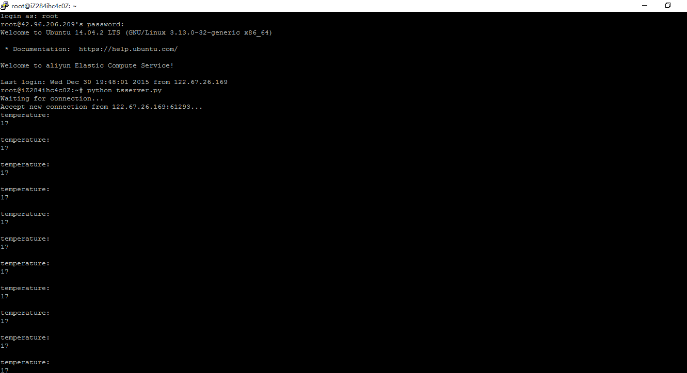

## ** 软件设计**

其实软件方面在主机和从机的程序编写是比较简单的。这些方面不过多介绍。具体可查看代码。

主要过程是：从机通过24l01向主机不停地发送处理得到的传感器数据（温度数据），
<主机接收到后往串口发。当主机到检测到的AD值达到设定值后，向从机发送控制信号，控制电机旋转和舵机的旋转。

服务器：
我目前主要用Python写了个TCP服务器程序，主要功能是开启某个端口，并监听这个端口的数据，如果与TCP客户端握手成功，那么就接收到的来自TCP客户端的数据打印出来。

这是我通过SSH登录远程服务器后，运行写的python程序后的效果：

可以看见温度（temperature）是17度
